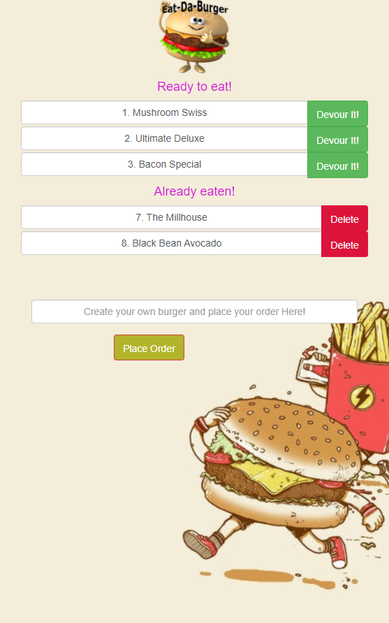
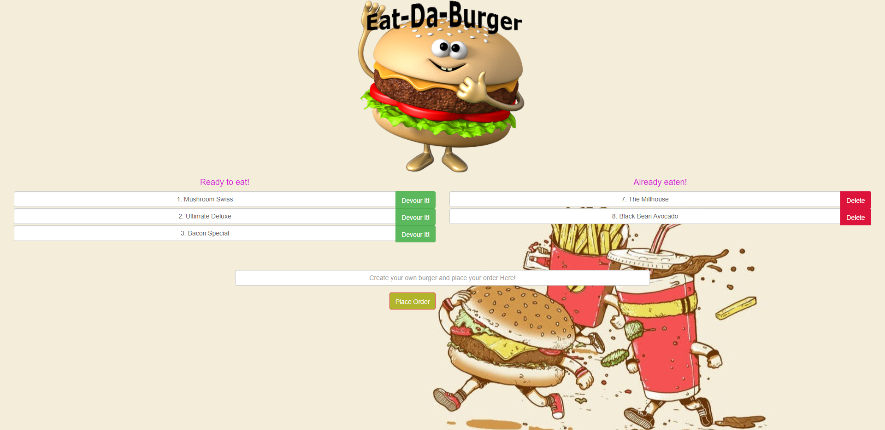

## Description
``
Eat-Da-Burger! is a full stack, MVC (Model-View-Controller) application that allows you to create burgers (POST), view a list of burgers available to eat (GET), devour burgers (PUT), and throw them away after devoured (DELETE).
``
## Table of- Contents
- [Questions](#Questions)
- [Description](#Description)
- [License](#License)
- [Live App Link](#Live-App-Link)
- [Mobile Screen Capture](#Mobile-Screen-Capture)
- [Screen Capture](#Screen-Capture)
- [Repository Link](#Repository)
- [Contributors](#Contributors) 

## Live App Link

- [Heroku App Link](https://eat-da-burger-42830.herokuapp.com/)

# Mobile screen capture

# Screen Capture

## License

## Contributors
``
Bobby Jones Jr.
``
## Repository

- [Project Repo](https://github.com/jones9682/Eat-Da-Burger)

## Questions

If you have any questions about the repo, open an issue or contact me directly at jones9682@yahoo.com. You can find more of my work at my [GitHub Profile](https://github.com/jones9682).
  
  